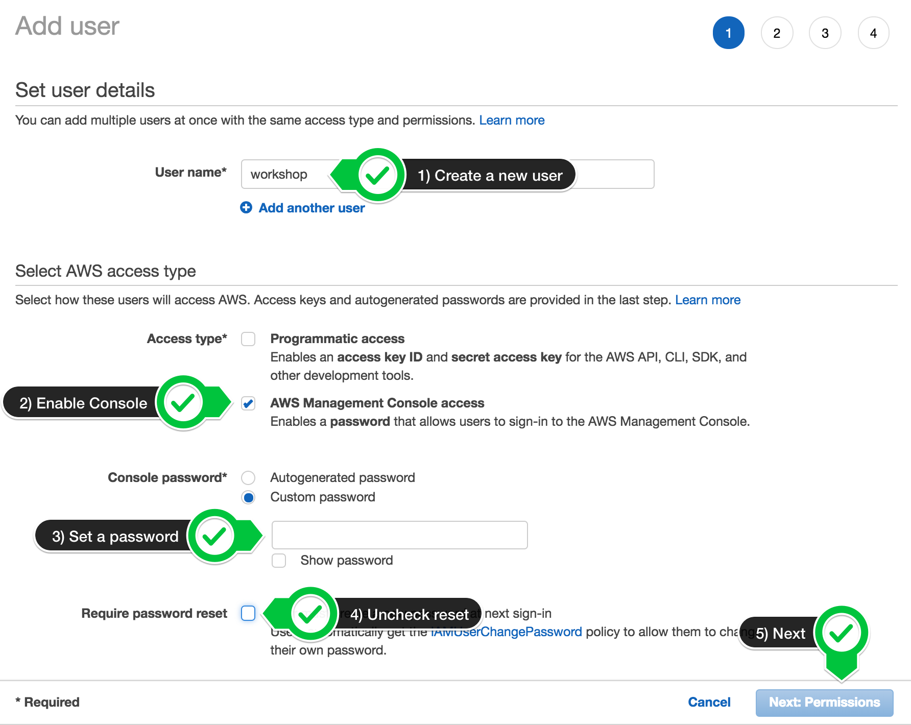
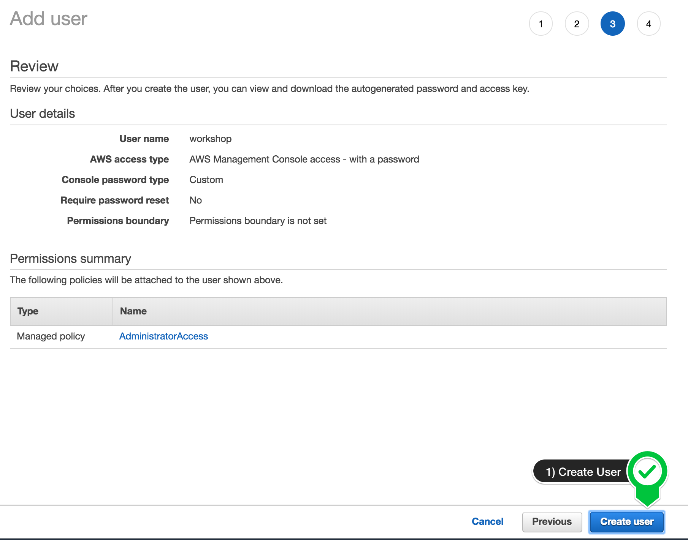
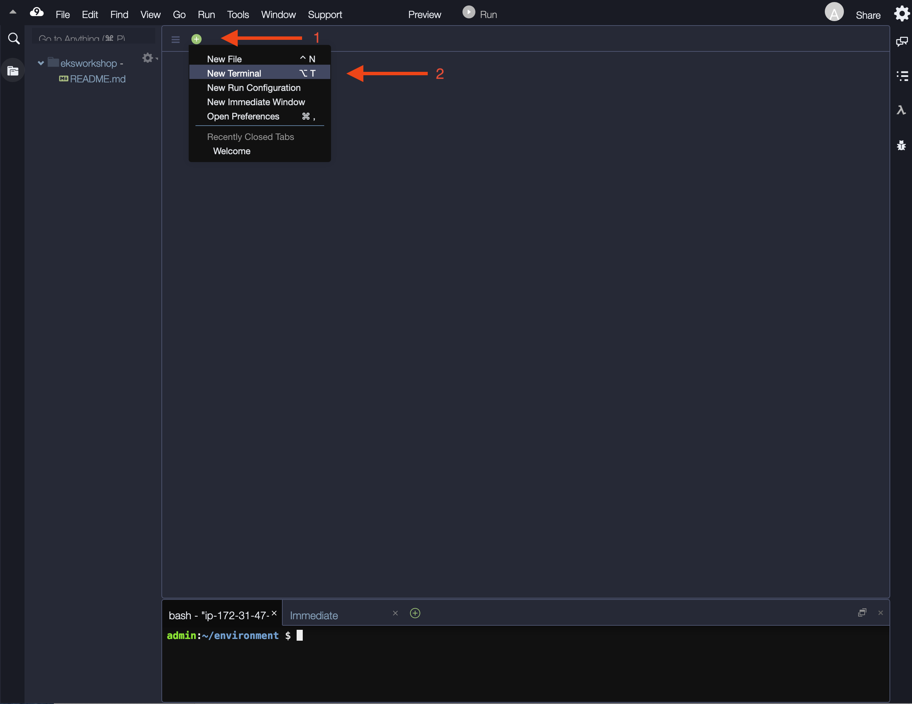

# Amazon EKS
## EKS CLUSTER CREATION WORKFLOW

Let's start with the first bullet point "Create EKS cluster".
- Here we're reducing all of the necessary steps to setup a Kubernetes cluster to one single bullet point.
- Rest of the steps are the same whether you use a DIY cluster or an EKS cluster.
- Creating an EKS cluster is for us simply running an command. You can compare this with the DIY steps, we've to bring up the ETCD nodes, control plane nodes, ETCD nodes will build a quoram and then the rest of the control place components will start working.
- Only then, the worker nodes can be added and services deployed.
- All of this happens by running a single command in EKS.
- What happens when you create your EKS cluster?
  

- When you look at the EKS cluster you'll build, you'll not see the control plane nodes. You'll probably see the ENIs that are attached to different components of the cluster.

- EKS Architecture for Control Plane and Worker node communication
  

- In the above architecture diagram, we use 2 VPCs
  - One that will consist of all of the control plane nodes (the one on the right)
  - The other will consist of all of the worker nodes.

- All of the communication happens using ENIs which makes it seem like the communication is all happening in the same VPC.

- The Network Load Balancer ensures that the communication between the Kubelet and the API server is appropriately distributed.

- Once your EKS cluster is ready, you get an API endpoint and you’d use [Kubectl](https://kubernetes.io/docs/reference/kubectl/kubectl/), community developed tool to interact with your cluster.
  

- When you use the `kubectl` commands, the request essentially goes to the AWS managed EKS control plane and then distributes the traffic to the relevant worker nodes in the customer managed VPC.


# Getting Started
## Create an AWS Account
-  If you don’t already have an AWS account with Administrator access: [create one now by clicking here](https://aws.amazon.com/getting-started/)

- Once you have an AWS account, ensure you are following the remaining workshop steps as an IAM user with administrator access to the AWS account: [Create a new IAM user to use for the workshop](https://console.aws.amazon.com/iam/home?#/users$new).

- Enter the user details:
  

- Attach the AdministratorAccess IAM Policy:
  

- Click to create the new user:
  

- Take note of the login URL and save:
  


## Create a Workspace
- Launch Cloud9 in your closest region:
  - Oregon: https://us-west-2.console.aws.amazon.com/cloud9/home?region=us-west-2
  - Ireland: https://eu-west-1.console.aws.amazon.com/cloud9/home?region=eu-west-1
  - Ohio: https://us-east-2.console.aws.amazon.com/cloud9/home?region=us-east-2
  - Singapore: https://ap-southeast-1.console.aws.amazon.com/cloud9/home?region=ap-southeast-1

- Select Create environment
- Name it eksworkshop, click Next.
- Choose t3.small for instance type, take all default values and click Create environment
- When it comes up, customize the environment by:

  - Closing the Welcome tab
  

- Opening a new terminal tab in the main work area
  

- Closing the lower work area
  
- Your workspace should now look like this
  

- Increase the disk size on the Cloud9 instance.
  - __The following command adds more disk space to the root volume of the EC2 instance that Cloud9 runs on. Once the command completes, we reboot the instance and it could take a minute or two for the IDE to come back online.__
  ```python
  pip3 install --user --upgrade boto3
  export instance_id=$(curl -s http://169.254.169.254/latest/meta-data/instance-id)
  python -c "import boto3
  import os
  from botocore.exceptions import ClientError
  ec2 = boto3.client('ec2')
  volume_info = ec2.describe_volumes(
    Filters=[
        {
            'Name': 'attachment.instance-id',
            'Values': [
                os.getenv('instance_id')
            ]
        }
    ]
  )
  volume_id = volume_info['Volumes'][0]['VolumeId']
  try:
    resize = ec2.modify_volume(    
            VolumeId=volume_id,    
            Size=30
    )
    print(resize)
  except ClientError as e:
    if e.response['Error']['Code'] == 'InvalidParameterValue':
        print('ERROR MESSAGE: {}'.format(e))"
  if [ $? -eq 0 ]; then
    sudo reboot
  fi

  ```

## Install Kubernetes Tools
- Install kubectl
```
sudo curl --silent --location -o /usr/local/bin/kubectl \
   https://amazon-eks.s3.us-west-2.amazonaws.com/1.19.6/2021-01-05/bin/linux/amd64/kubectl

sudo chmod +x /usr/local/bin/kubectl
```

- Update awscli
Upgrade AWS CLI according to guidance in [AWS documentation](https://docs.aws.amazon.com/cli/latest/userguide/install-cliv2-linux.html).
```
curl "https://awscli.amazonaws.com/awscli-exe-linux-x86_64.zip" -o "awscliv2.zip"
unzip awscliv2.zip
sudo ./aws/install
```
- Install jq, envsubst (from GNU gettext utilities) and bash-completion
```
sudo yum -y install jq gettext bash-completion moreutils
```

- Install yq for yaml processing
```
echo 'yq() {
  docker run --rm -i -v "${PWD}":/workdir mikefarah/yq "$@"
}' | tee -a ~/.bashrc && source ~/.bashrc
```

- Verify the binaries are in the path and executable
```
for command in kubectl jq envsubst aws
  do
    which $command &>/dev/null && echo "$command in path" || echo "$command NOT FOUND"
  done
```

- Enable kubectl bash_completion
```
kubectl completion bash >>  ~/.bash_completion
. /etc/profile.d/bash_completion.sh
. ~/.bash_completion
```

- Set the AWS Load Balancer Controller version
```
echo 'export LBC_VERSION="v2.2.0"' >>  ~/.bash_profile
.  ~/.bash_profile
```


## Create an IAM role for your Workspace
- Follow [this](https://console.aws.amazon.com/iam/home#/roles$new?step=review&commonUseCase=EC2%2BEC2&selectedUseCase=EC2&policies=arn:aws:iam::aws:policy%2FAdministratorAccess&roleName=eksworkshop-admin) deep link to create an IAM role with Administrator access.
- Confirm that `AWS service` and `EC2` are selected, then click `Next: Permissions` to view permissions.
- Confirm that `AdministratorAccess` is checked, then click `Next: Tags` to assign tags.
- Take the defaults, and click `Next: Review` to review.
- Enter __eksworkshop-admin__ for the Name, and click `Create role`
  


## Attach the IAM role to your Workspace
- Click the grey circle button (in top right corner) and select `Manage EC2 Instance.`
  

- Select the instance, then choose `Actions / Security / Modify IAM Role`
  

- Choose `eksworkshop-admin` from the` IAM Role` drop down, and select `Save`
  

## Update IAM Settings for your Workspace
Cloud9 normally manages IAM credentials dynamically. This isn’t currently compatible with the EKS IAM authentication, so we will disable it and rely on the IAM role instead.

- Return to your Cloud9 workspace and click the gear icon (in top right corner)
- Select `AWS SETTINGS`
- Turn off `AWS managed temporary credentials`
- Close the Preferences tab
  

- To ensure temporary credentials aren’t already in place we will also remove any existing credentials file:
```
rm -vf ${HOME}/.aws/credentials
```
We should configure our aws cli with our current region as default.
```
export ACCOUNT_ID=$(aws sts get-caller-identity --output text --query Account)
export AWS_REGION=$(curl -s 169.254.169.254/latest/dynamic/instance-identity/document | jq -r '.region')
export AZS=($(aws ec2 describe-availability-zones --query 'AvailabilityZones[].ZoneName' --output text --region $AWS_REGION))
```

- Check if AWS_REGION is set to desired region
```
test -n "$AWS_REGION" && echo AWS_REGION is "$AWS_REGION" || echo AWS_REGION is not set
```

- Let’s save these into bash_profile
```
echo "export ACCOUNT_ID=${ACCOUNT_ID}" | tee -a ~/.bash_profile
echo "export AWS_REGION=${AWS_REGION}" | tee -a ~/.bash_profile
echo "export AZS=(${AZS[@]})" | tee -a ~/.bash_profile
aws configure set default.region ${AWS_REGION}
aws configure get default.region
```
- Validate the IAM role
Use the [GetCallerIdentity](https://docs.aws.amazon.com/cli/latest/reference/sts/get-caller-identity.html) CLI command to validate that the Cloud9 IDE is using the correct IAM role.
```
aws sts get-caller-identity --query Arn | grep eksworkshop-admin -q && echo "IAM role valid" || echo "IAM role NOT valid"
```

__If the IAM role is not valid, DO NOT PROCEED. Go back and confirm the steps on this page.__

## Clone the service repos
```
cd ~/environment
git clone https://github.com/aws-containers/ecsdemo-frontend.git
git clone https://github.com/saikiranchalla1/ecsdemo-nodejs.git
git clone https://github.com/saikiranchalla1/ecsdemo-crystal.git
```

## Create an AWS KMS Customer Managed Key
Create a CMK for the EKS cluster to use when encrypting your Kubernetes secrets:
```
aws kms create-alias --alias-name alias/eksworkshop --target-key-id $(aws kms create-key --query KeyMetadata.Arn --output text)
```

Let’s retrieve the ARN of the CMK to input into the create cluster command.
```
export MASTER_ARN=$(aws kms describe-key --key-id alias/eksworkshop --query KeyMetadata.Arn --output text)
```

We set the MASTER_ARN environment variable to make it easier to refer to the KMS key later.

Now, let’s save the MASTER_ARN environment variable into the bash_profile
```
echo "export MASTER_ARN=${MASTER_ARN}" | tee -a ~/.bash_profile
```

# Launch Using [EKSCTL](https://eksctl.io/)
[eksctl](https://eksctl.io/) is a tool jointly developed by AWS and [Weaveworks](https://weave.works/) that automates much of the experience of creating EKS clusters.

In this module, we will use eksctl to launch and configure our EKS cluster and nodes.

## Prerequisites
For this module, we need to download the eksctl binary:
```
curl --silent --location "https://github.com/weaveworks/eksctl/releases/latest/download/eksctl_$(uname -s)_amd64.tar.gz" | tar xz -C /tmp

sudo mv -v /tmp/eksctl /usr/local/bin
```

Confirm the eksctl command works:
```
eksctl version
```

Enable eksctl bash-completion

```
eksctl completion bash >> ~/.bash_completion
. /etc/profile.d/bash_completion.sh
. ~/.bash_completion
```

## Launch EKS
__DO NOT PROCEED with this step unless you have validated the IAM role in use by the Cloud9 IDE. You will not be able to run the necessary kubectl commands in the later modules unless the EKS cluster is built using the IAM role.__

Challenge: How do I check the IAM role on the workspace?
Run `aws sts get-caller-identity` and validate that your Arn contains eksworkshop-adminand an Instance Id.
```
{
    "Account": "123456789012",
    "UserId": "AROA1SAMPLEAWSIAMROLE:i-01234567890abcdef",
    "Arn": "arn:aws:sts::123456789012:assumed-role/eksworkshop-admin/i-01234567890abcdef"
}
```
If you do not see the correct role, please go back and validate the IAM role for troubleshooting.

If you do see the correct role, proceed to next step to create an EKS cluster.

### Create an EKS Cluster
Create an eksctl deployment file (eksworkshop.yaml) use in creating your cluster using the following syntax:
```
cat << EOF > eksworkshop.yaml
---
apiVersion: eksctl.io/v1alpha5
kind: ClusterConfig

metadata:
  name: eksworkshop-eksctl
  region: ${AWS_REGION}
  version: "1.19"

availabilityZones: ["${AZS[0]}", "${AZS[1]}", "${AZS[2]}"]

managedNodeGroups:
- name: nodegroup
  desiredCapacity: 3
  instanceType: t3.small
  ssh:
    enableSsm: true

# To enable all of the control plane logs, uncomment below:
# cloudWatch:
#  clusterLogging:
#    enableTypes: ["*"]

secretsEncryption:
  keyARN: ${MASTER_ARN}
EOF
```

Next, use the file you created as the input for the eksctl cluster creation.
__We are deliberatly launching at least one Kubernetes version behind the latest available on Amazon EKS. This allows you to perform the cluster upgrade lab.__

```
eksctl create cluster -f eksworkshop.yaml
```
__Launching EKS and all the dependencies will take approximately 15 minutes__


## Test the Cluster
Confirm your nodes:
```
kubectl get nodes # if we see our 3 nodes, we know we have authenticated correctly
```

Export the Worker Role Name for use throughout the workshop:
```
STACK_NAME=$(eksctl get nodegroup --cluster eksworkshop-eksctl -o json | jq -r '.[].StackName')
ROLE_NAME=$(aws cloudformation describe-stack-resources --stack-name $STACK_NAME | jq -r '.StackResources[] | select(.ResourceType=="AWS::IAM::Role") | .PhysicalResourceId')
echo "export ROLE_NAME=${ROLE_NAME}" | tee -a ~/.bash_profile
```

__Congratulations!__
You now have a fully working Amazon EKS Cluster that is ready to use! Before you move on to any other labs, make sure to complete the steps on the next page to update the EKS Console Credentials.

## Console Credentials
This step is optional, as nearly all of the workshop content is CLI-driven. But, if you’d like full access to your workshop cluster in the EKS console this step is recommended.

The EKS console allows you to see not only the configuration aspects of your cluster, but also to view Kubernetes cluster objects such as Deployments, Pods, and Nodes. For this type of access, the console IAM User or Role needs to be granted permission within the cluster.

By default, the credentials used to create the cluster are automatically granted these permissions. Following along in the workshop, you’ve created a cluster using temporary IAM credentials from within Cloud9. This means that you’ll need to add your AWS Console credentials to the cluster.

### Import your EKS Console credentials to your new cluster:
IAM Users and Roles are bound to an EKS Kubernetes cluster via a ConfigMap named `aws-auth`. We can use `eksctl` to do this with one command.

You’ll need to determine the correct credential to add for your AWS Console access. If you know this already, you can skip ahead to the `eksctl create iamidentitymapping` step below.

If you’ve built your cluster from Cloud9 as part of this tutorial, invoke the following within your environment to determine your IAM Role or User ARN.
```
c9builder=$(aws cloud9 describe-environment-memberships --environment-id=$C9_PID | jq -r '.memberships[].userArn')
if echo ${c9builder} | grep -q user; then
	rolearn=${c9builder}
        echo Role ARN: ${rolearn}
elif echo ${c9builder} | grep -q assumed-role; then
        assumedrolename=$(echo ${c9builder} | awk -F/ '{print $(NF-1)}')
        rolearn=$(aws iam get-role --role-name ${assumedrolename} --query Role.Arn --output text)
        echo Role ARN: ${rolearn}
fi
```

With your ARN in hand, you can issue the command to create the identity mapping within the cluster.
```
eksctl create iamidentitymapping --cluster eksworkshop-eksctl --arn ${rolearn} --group system:masters --username admin
```

Note that permissions can be restricted and granular but as this is a workshop cluster, you’re adding your console credentials as administrator.

Now you can verify your entry in the AWS auth map within the console.
```
kubectl describe configmap -n kube-system aws-auth
```

Now you’re all set to move on. For more information, check out the [EKS documentation](https://docs.aws.amazon.com/eks/latest/userguide/add-user-role.html) on this topic.
